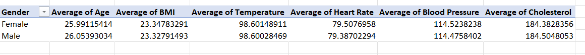
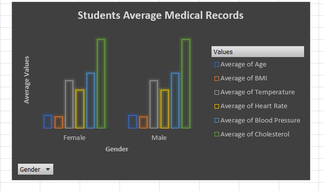
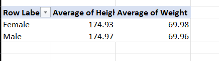
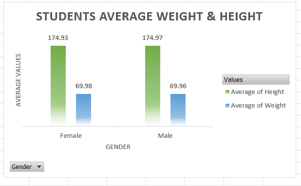
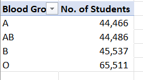
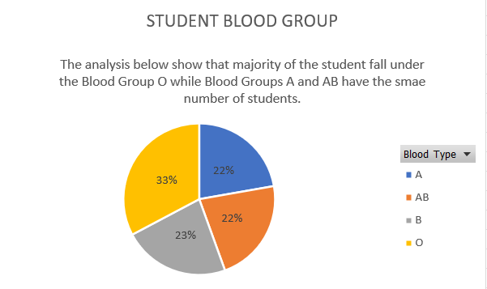
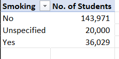
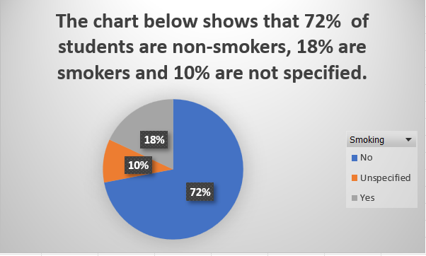
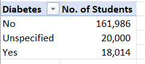
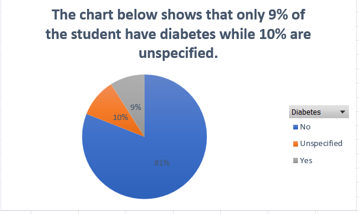

# Medical-Students-Health-Record

## INTRODUCTION

This task aims to exhibit my knowledge and skill in analysing data using Pivot tables and data visualisation by using visuals to give insights on the dataset analysed. 

*_Disclaimer_*: _All datasets used are dummy datasets and do not represent any company or institution._

## PROBLEM STATEMENT

1.	What are the average values for the BMI, Age, Temperature, Heart Rate, Blood Pressure and Cholesterol for both genders?
2.	What are the average height and weight for both genders? Return the values to two decimal places.
3.	What is the total number of students across the different blood groups?
4.	What is the total number of students who smoke compared to those who do not smoke?
5.	What is the total number of students who have diabetes compared to those who do not?

## SKILLS DEMONSTRATED

-	Data Cleaning and Transformation: filling in the blanks and formatting the dataset to ensure the data does not return errors during analysis.
-	Pivot Table: to analyse the dataset.
-	Data Visualisation: using Pivot Charts to show comparisons, patterns and trends from the analysis done in the pivot table.

## DATA SOURCING

This data was obtained from the Medical Records in the Data Analytics Cohort 4 Repository. The data contains 1 sheet with a table containing 200,000 rows and 13 columns.

## DATA TRANSFORMATION & CLEANING

The data provided contained blank spaces which were cleaned by filling the columns that had numbers with the average value of their total sum, the female gender was used to fill the blanks in the gender column, the blood group ‘O’ was used to fill the blanks in the blood group column while the blanks in the smoking and diabetes columns were returned as unspecified.

## ANALYSIS & VISUALISATION

AVERAGE VALUES PIVOT TABLE            |        AVERAGE VALUES PIVOT CHART
:-------------------------------------|------------------------------------:
   |

- The average age for both male and female students is 26 years, indicating that the students are, on average, in the same age range.
- The average BMI for male students (23.33) is slightly higher than that of female students (23.25), but the difference is minimal, suggesting a generally healthy weight distribution among the students.
- Both male and female students have the same average body temperature of 98.6 degrees Fahrenheit, which is within the normal range.
- Male students have a slightly lower average heart rate (79.39) compared to female students (79.51), but the difference is slight and may not be clinically significant.
- Both male and female students have similar average blood pressure levels, with only a minor difference between them.
- Male students have a slightly higher average cholesterol level (184.50) compared to female students (184.38), but the difference is relatively small and may not be clinically significant.

AVERAGE VALUES FOR HEIGHT & WEIGHT PIVOT TABLE            |       AVERAGE VALUES FOR HEIGHT & WEIGHT PIVOT CHART
:---------------------------------------------------------|-----------------------------------------------------:
                      |

- Both male and female students have very similar average heights, with the difference being negligible. This suggests a relatively uniform distribution of height among the students.
- The average weight for male and female students is also very close, indicating that there is no significant gender-based difference in weight.

BLOOD GROUP PIVOT TABLE                                   |                      BLOOD GROUP PIVOT CHART
:---------------------------------------------------------|-------------------------------------------------------:
                          |

The dataset includes information about blood groups among the students. Blood Group O is the most common, followed by Blood Group B, A, and AB, with 23% of students in each of the latter three groups.

NO. OF STUDENTS SMOKING PIVOT TABLE                       |         NO. OF STUDENTS SMOKING PIVOT CHART
:---------------------------------------------------------|--------------------------------------------------------:
                              |

The majority of students (72%) do not smoke, which is a good sign for their health. However, 18% of students smoke, and 10% refrain from disclosing their smoking status. It is critical to encourage and support healthy behaviours among students.

NO. OF STUDENTS WITH DIABETES PIVOT TABLE     |    NO. OF STUDENTS WITH DIABETES PIVOT CHART
:---------------------------------------------|-----------------------------------------------------------------:
                 |

The vast majority of pupils (81%) do not have diabetes, whereas 9% do, and 10% fail to indicate their diabetes status. Understanding the prevalence of diabetes among students is crucial for healthcare planning and intervention

## CONCLUSION AND RECOMMENDATIONS

In summary,  the dataset provides insights into the physiological measurements, blood groups, and lifestyle factors of medical students. While there are some slight gender gaps in certain health indicators. The findings show that the majority of students have a healthy BMI, blood pressure, and temperature. The most common blood type is O, and the majority of students are nonsmokers with no diabetes. 

Based on these findings, it is essential to maintain monitoring and supporting healthy behaviours among students. Further data analysis or stratification may also be necessary to evaluate potential connections or linkages between these health factors and other health outcomes or risk factors. Obtaining data from students who did not disclose their smoking or diabetes status can offer a broader view of the student population's health.
